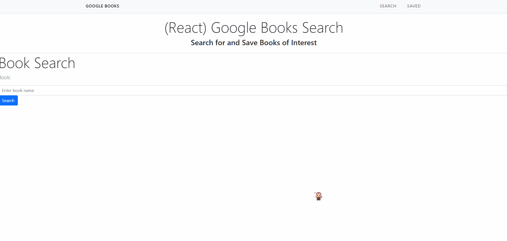

# Google-book-search

Description
------------

Google book search that works by typing in title of book you would like to search. You may also save your books for future use and delete the books as you desire.

 Table of contents
---------------
[Tools used](#Tools-used) 
[Deployed here](#Deployed-here) 
[Features](#Features) 
[Lessons learned](#Lessons-learned) 
[Credits](#Credits) 
[License](#License)

Tools used
-------------------

* Bootstrap - Has premade layouts and components useful for making a webpage without having to start from scratch. 
* CSS - Style the page with custom colors, and spacing.
* Express - Routing from backend to frontend.
* GitBash - Assist with version control via commits, push, and pull to and from GitHub.
* GitHub - Site where the repository lies for deployment and edits.
* HTML - Contains the base of the webpage and allows browsers to interpret the code as a webpage.
* MongoDB - Database storage for the books that will be saved.
* Node.js - Calls in modules necessary for bulma CSS styling.
* React - Frontend javascript library utilized to create the entire portfolio.
* VS Code - Application used to write and edit code for the webpage.

Deployed here
-------------

Below is the link to the deployed webpage.  
[Link to site](https://google-book-search-vnguyen8931.herokuapp.com/)

Features
-------------
This google books search can search up partial or full titles of books then lists them below in a list. The user may choose the books they would like to save to their own list or view the book on google's site. On the saved page, the user will be able to view the book and delete the book from the database. 

Lessons learned
------------------------------
We faced significant difficulties when routing the server to the frontend React pages. We were able to achieve this with help from the TA's during this course. The solution is to create the api's in the backend and also the frontend. THe difference being that in the frontend, an axios call is used to call upon the apis created in the backend. 

Another issue we had was creating the list items to display to the page properly, each with their own card. The solution was to create additional components, one to hold the list, then another to hold the items to be posted. This required the use of states in which the books array was created.Inside the list items component, we mapped through the books array we created based on the text in the input bar. Then we laid out the code for how we wanted the page to look and called in the proper information per line. We called the list items class inside of the list, then call that list in the results page in regards to searching for books. This achieved our desired results.

An issue that we didn't find a solution for was to have the save and delete buttons to function with the mongo database. We had created the save and delete functions, however they do not link to the database. I hypothesize that the database is not called upon properly in our connection or server.js files.

Credits
---------------
Vincent Nguyen  
LinkedIn: [https://www.linkedin.com/in/vincent-nguyen-74226a107/](https://www.linkedin.com/in/vincent-nguyen-74226a107/)  
GitHub: [https://github.com/vincent-nguyen8931](https://github.com/vincent-nguyen8931)  
Portfolio: [https://vincent-nguyen8931.github.io/react-portfolio/](https://vincent-nguyen8931.github.io/react-portfolio/)

Austin Woo  
GitHub: [https://github.com/austinwoo123](https://github.com/austinwoo123)  
Portfolio: [https://enigmatic-castle-29617.herokuapp.com/](https://enigmatic-castle-29617.herokuapp.com/)  

License
----------
MIT License

Copyright (c) [2021] [Vincent Nguyen] [Austin Woo]

Permission is hereby granted, free of charge, to any person obtaining a copy
of this software and associated documentation files (the "Software"), to deal
in the Software without restriction, including without limitation the rights
to use, copy, modify, merge, publish, distribute, sublicense, and/or sell
copies of the Software, and to permit persons to whom the Software is
furnished to do so, subject to the following conditions:

The above copyright notice and this permission notice shall be included in all
copies or substantial portions of the Software.

THE SOFTWARE IS PROVIDED "AS IS", WITHOUT WARRANTY OF ANY KIND, EXPRESS OR
IMPLIED, INCLUDING BUT NOT LIMITED TO THE WARRANTIES OF MERCHANTABILITY,
FITNESS FOR A PARTICULAR PURPOSE AND NONINFRINGEMENT. IN NO EVENT SHALL THE
AUTHORS OR COPYRIGHT HOLDERS BE LIABLE FOR ANY CLAIM, DAMAGES OR OTHER
LIABILITY, WHETHER IN AN ACTION OF CONTRACT, TORT OR OTHERWISE, ARISING FROM,
OUT OF OR IN CONNECTION WITH THE SOFTWARE OR THE USE OR OTHER DEALINGS IN THE
SOFTWARE.